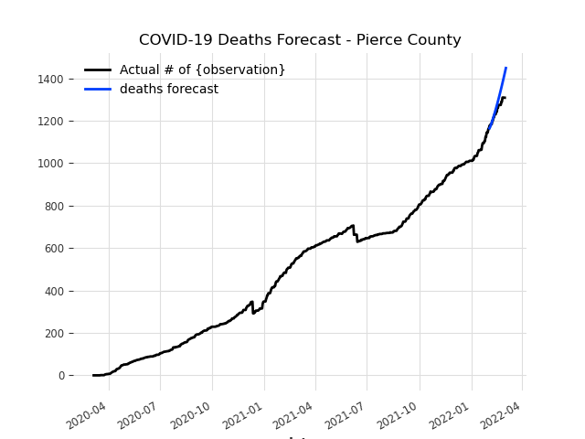
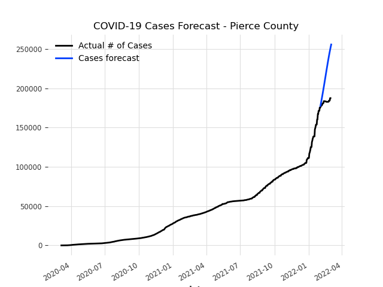

# COVID Cases/Deaths Predictor

Author: Nathan Waltz

I am creating an LSTM-RNN with 8 hidden layers to predict how many deaths there will be on a given day in ***Pierce County, WA*** using this [dataset](https://raw.githubusercontent.com/nytimes/covid-19-data/master/us-counties.csv). 

Usage of this program requires installation of the `Darts` package as well as `Pytorch`. You can do this either via Anaconda or pip!

## Plot of Projected COVID-19 Deaths (as of March 02, 2021)

## Plot of COVID-19 Cases (as of March 02, 2021)

