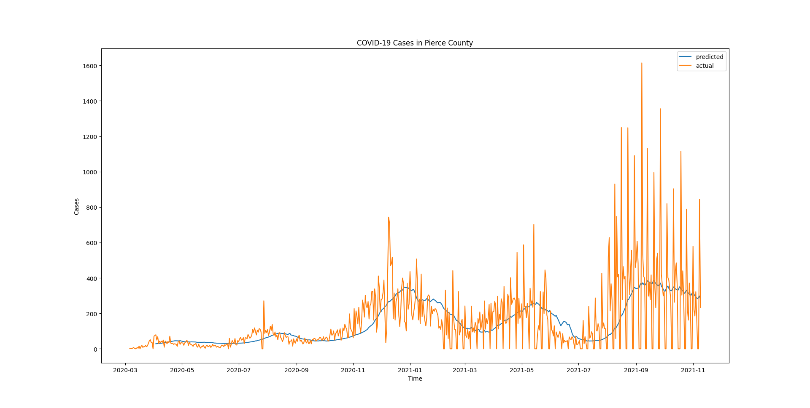
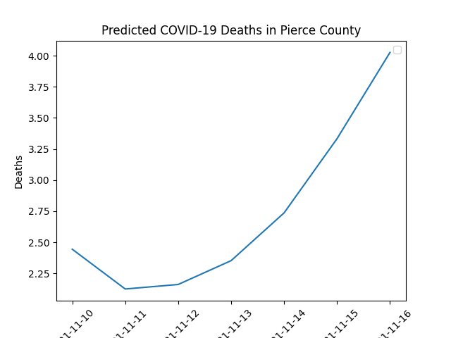
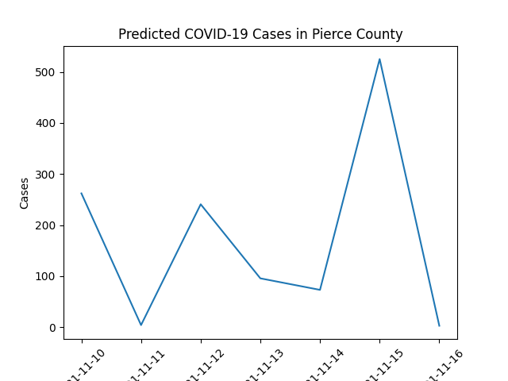

# COVID-WA-LSTM

I am creating an LSTM to predict how many deaths there will be on a given day, 
based on previous days with a time lag. I am currently using the deaths that occured in the past 4 weeks as a predictor.

NOTE: This LSTM is not entirely complete yet, I still have to do some hyperparameter optimization. Also, its bias towards zeros, and that needs to be fixed.

I am using this [dataset](https://raw.githubusercontent.com/nytimes/covid-19-data/master/us-counties.csv)

## Plot of COVID-19 Deaths (as of November 10, 2021)

## Plot of COVID-19 Cases (as of November 10, 2021)

## Plot of predicted COVID-19 Deaths (as of November 10, 2021)

## Plot of predicted COVID-19 Cases (as of November 10, 2021)

